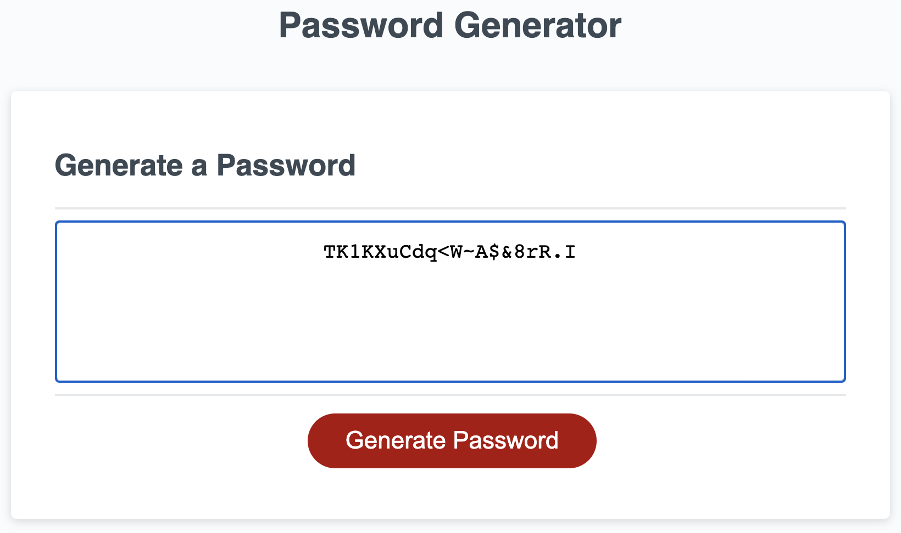

# Password Generator

## Requirements

Use JavaScript to create an application that generates a random password based on user-selected criteria.

* User clicks button to generate a password

* User is presented with a list of password criteria (lowercase, uppercase, numeric, special character) and asked to select at least one to include in the password

* User is asked to enter the length of password

* Generated password is shown on the page

## Website Walk-Through

Click the red _Generate Password_ button to generate a password.

## Files

* `index.html`

* `script.js`

* `style.css`

* `screenshot.png`

* `README.md`
